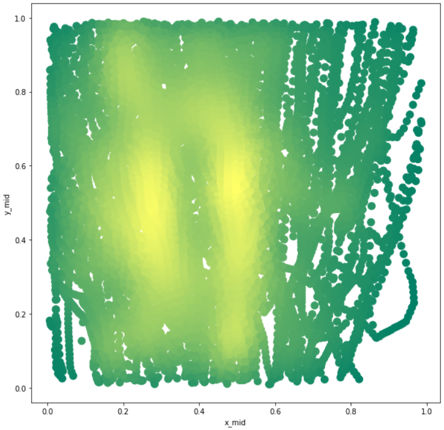
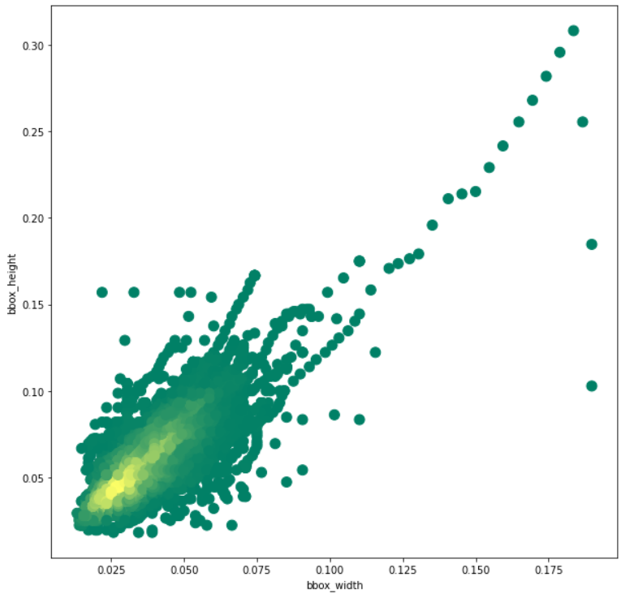

# Kaggle-Cots-detection

[Readme - 中文版](https://github.com/RaphaelCCH-K/Kaggle-Cots-detection)

Using object detection to detect starfish in underwater videos.

Competition link: [Kaggle: TensorFlow - Help Protect the Great Barrier Reef](https://www.kaggle.com/competitions/tensorflow-great-barrier-reef/overview)

## Introduction

### Background

Nowadays, the reef is under threat, in part because of the overpopulation of one particular starfish – the coral-eating crown-of-thorns starfish (or COTS for short). Scientists, tourism operators, and reef managers established a large-scale intervention program to control COTS outbreaks to ecologically sustainable levels.

### Tasks

The goal of this competition is to accurately identify starfish in real-time by building an object detection model trained on underwater videos of coral reefs.

### Evaluation

This competition is evaluated on the $F_2-Score$ at different intersections over union (IoU) thresholds. The metric sweeps over IoU thresholds in the range of 0.3 to 0.8 with a step size of 0.05, calculating an $F_2-Score$ at each threshold. The final $F_2-Score$ is calculated as the mean of the F2 scores at each IoU threshold.

## Dataset

The source of the dataset: [The CSIRO Crown-of-Thorn Starfish Detection Dataset](https://arxiv.org/abs/2111.14311)

The training dataset is 3 videos, consisting of 23503 1280 x 720 images, and the train.csv file containing the target boxes in the images. The figure following is the display of the target box in the image.

- `train_images/` - 训练数据集，形如 `video_{video_id}/{video_frame}.jpg`.
- `annotations` - 储存 Python 字符串格式的海星检测框的数据，在 test.csv 中不可用，描述了边界框由图像左下角的像素坐标`(x_min, y_min)`及其以像素为单位的`width`和`height`，（COCO格式）

picture-1（包含目标框）

picture-2（包含目标框）

train.csv部分

## 方案

### 1. 数据处理

训练数据集总共 23501 张图片，其中 20.93% 是有BBox的，因为没有BBox的图片都是背景，对模型训练并没有什么正向作用，所以去除没有BBox的图片，剩下的作为我们的训练数据集。

训练数据集分为 3 个视频，因为视频前后帧的强相关性，就不能随机拆分训练集和验证集，所以使用 3 折交叉验证，以不同的视频来划分。

将原始边缘框格式重写为 YOLO 格式。YOLO 格式：一个`.txt`对应一张图片，一行对应一个物体，第一部分是`class_id`，后面四个数分别是`BBox`的 (中心x坐标，中心y坐标，宽，高)，这些坐标都是 0～1 的相对坐标。将`.txt`的文件保存在`Kaggle/labels`的路径下。

### 2. 数据分析

对数据集中的 BBox 的数据分布进行可视化，对后续的策略能有一定的启发。

首先对检测框的中心位置进行可视化，如左下图 (pic.4)，可以看到检测框在 y 轴分布较均匀，在 x 轴的中间和中间偏左比较集中。接下来对检测框的大小进行分析，如右下图 (pic.5)，可以观察到检测框的大小集中在 `20 x 20 ~ 60 x 60`左右，部分大的可以达到`200 x 200`的像素，总体来说尺寸较小。

|         pic.4 检测框中心位置          |       pic.5 检测框的长度和宽度       |
| :-----------------------------------: | :----------------------------------: |
|  |  |

### 3. 训练策略

- **baseline**：训练了 1280 分辨率的 yolov5s 模型，使用默认参数，得到 `F2-score` 0.546。

- **高分辨率**：由于检测目标尺寸较小，使用更大的分辨率可以在一定程度上提高分数，于是尝试训练了 1280、2560、3000、3500 分辨率的 yolov5 模型，同时也使用不同分辨率来推理，最后在 3000 推理分辨率的情况下得到一下的测试结果（线上 `F2-score`）：

  | **YOLOv5s分辨率选择** | **F2-Scores** |
  | :-------------------- | ------------- |
  | 1280                  | 0.573         |
  | 2560                  | 0.583         |
  | **3000**              | **0.588**     |
  | 3500                  | 0.587         |

  同时考虑线上和线下表现得情况下，3000 分辨率训练的 yolov5s，3000 分辨率推理可以达到一个较高的分数。

- **数据增强**：修改数据增强的方式，尝试多种不同的参数与增强方法，实验发现，增加水平竖直翻转和随机旋转对分数有提高，同时设置 mosaic 0.25，mixup 0.5，scale 0.5，使得线上和线下的分数有了一点提高（+0.01）。

- **设置置信度阈值**：默认的置信度阈值是 0.6，其实可以更低，本次比赛的评分标准是`F2-Score`，这意味着识别出更多的正类比减少更多的错误预测更重要，在yolov5中设置`F2-Score`的计算，同时实验了不同的置信度阈值，得到阈值为 0.1 的时候线下和线上分数都相对更高。

- **Tracking**：考虑到预测视频的前后帧是强相关的，所以在预测时加入了 tracking 的方法。比较常用的有 Deepsort 方法，是利用匈牙利算法和卡尔曼滤波的一种 tracking 方法，在本次比赛中最终使用的时 Norfair 的方法，原理和 Deepsort大同小异，Norfair 可以使用欧几里得距离来查找轨迹。具体 Norfair 库的说明请看官方说明 [Norfair - GitHub](https://github.com/tryolabs/norfair) 

- **WBF**：WBF 即加权框融合算法，和 NMS 类似是一种去除冗余框并融合框的方法，但根据算法的不同这两种方法得到的效果也不同，WBF 算法虽然更耗时，但在做多模型合并预测结果的时候有更好的结果，下图为 WBF 和 NMS 的一点区别，WBF 使用了所有的预测框来共同计算得到最终的框，NMS 是丢弃了一些预测框。更多细节可查看官方说明 [WBF - GitHub](https://github.com/ZFTurbo/Weighted-Boxes-Fusion)

  

  
WBF 算法的可视化

- **模型融合**：考虑到多尺度以及稳定性，于是使用模型融合，最终使用一个 1280 分辨率和一个 3000 分辨率的 yolov5 模型。

  | **模型及组合**                       | **F2-Score** |
  | ------------------------------------ | ------------ |
  | 3000yolov5s                          | 0.601        |
  | 3000yolov5s + Tracking               | **0.625**    |
  | 2560yolov5s + 3000yolov5s + Tracking | 0.633        |
  | 1280yolov5s + 3000yolov5s + Tracking | 0.658        |
  | 1280yolov5l + 3000yolov5s + Tracking | **0.664**    |

## 其他说明

### repo说明

- 训练代码：`train.ipynb`
- 推理代码：`infer.ipynb`

### Reference

[https://www.kaggle.com/code/awsaf49/great-barrier-reef-yolov5-train](https://www.kaggle.com/code/awsaf49/great-barrier-reef-yolov5-train)

[https://www.kaggle.com/code/awsaf49/great-barrier-reef-yolov5-infer](https://www.kaggle.com/code/awsaf49/great-barrier-reef-yolov5-infer)

[https://arxiv.org/pdf/1910.13302.pdf](https://arxiv.org/pdf/1910.13302.pdf)

[https://github.com/tryolabs/norfair](https://github.com/tryolabs/norfair)

[https://www.kaggle.com/competitions/tensorflow-great-barrier-reef/discussion/300638](https://www.kaggle.com/competitions/tensorflow-great-barrier-reef/discussion/300638)

### TODO

- TOP方法
- 代码整理
- 英文版 readme
- 重新训练得到分数上传到wandb

